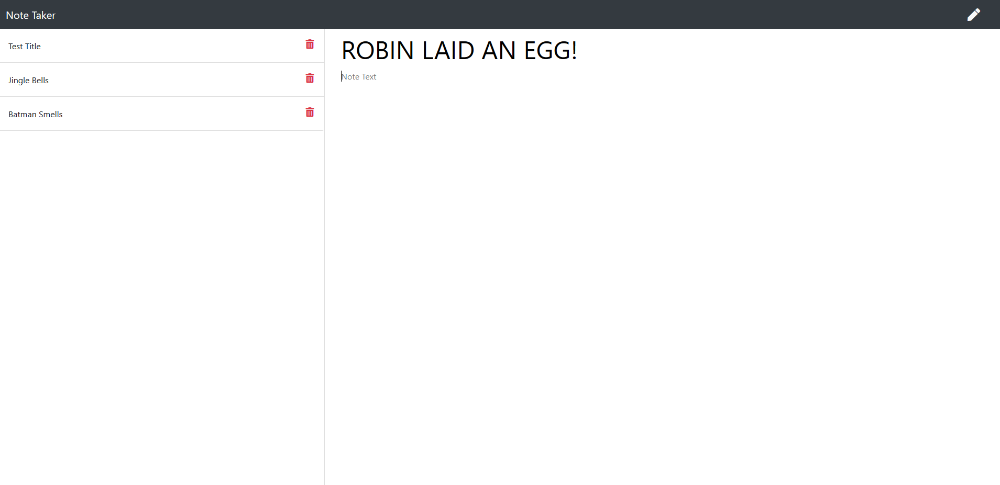

# Make-A-Note 📃✏

>A responsive note taking app to make everyday life easier

## 💻What I used💽
JavaScript, Node JS, Express

## Update Note (Mar 11, 2020)
- Added Skeleton file structure
- Added server functionality 
- Added the ability to delete notes

## Update Note (Mar 13, 2020)
- Fixed MIME errors that were preventing proper page load

## Testing

- Testing was done with POSTMAN

## I love getting feedback and support! 🎆🎇🎈

## 🕹🕹🎮 Preview

##Author

**🏍Dru Sanchez🏍**
*Twitter: [ImNotDrumatic](https://twitter.com/ImNotDrumatic)
*Github:  [DruSanchez](https://github.com/Drubaloo)